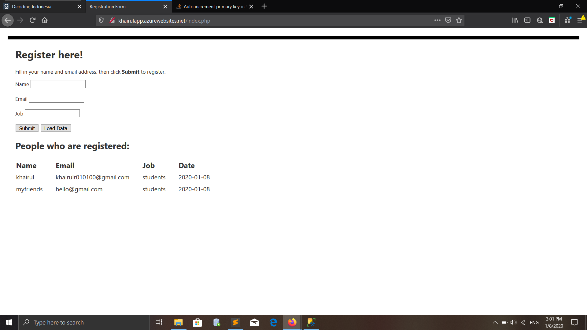

# Azure-Cloud-Dicoding
submittion

## submission1

### Kriteria

#### Aplikasi yang dikirimkan harus memiliki fitur:
    1. Form untuk menambahkan data ke database SQL azure db.
    2. Menampilkan data yang ada pada database SQL azure db.

## submission2

### Kriteria

#### Aplikasi yang dikirimkan harus memiliki fitur:
    1. Mengunggah berkas gambar ke Azure Blob Storage.
    2. Menampilkan berkas yang sudah diunggah ke Azure Blob Storage.
    3. Melakukan analisis gambar menggunakan Cognitive Services.

Dengan demikian code berikut sebagai contoh dan referensi bagi teman-teman yang sedang mengerjakan submission dari azure dicoding. semoga dapat membantu. thx
